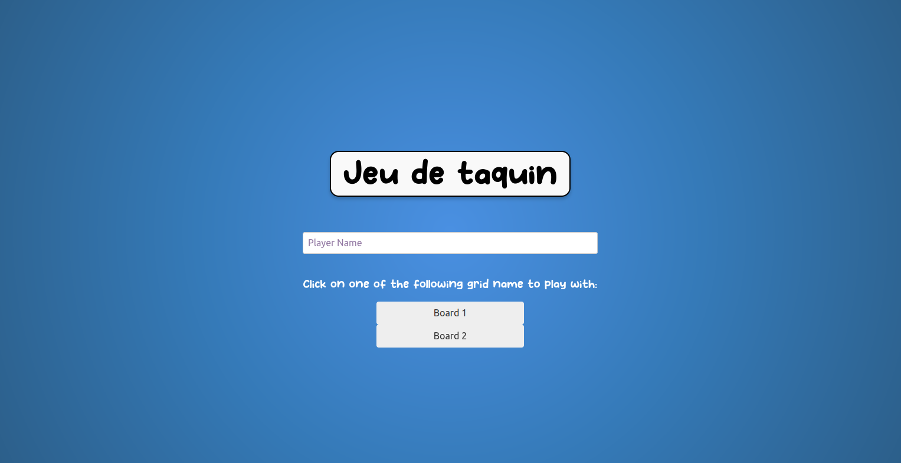
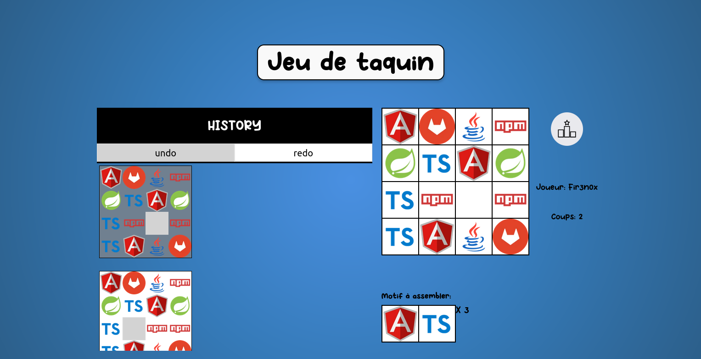

# Jeu du Taquin – Angular & Spring Boot

Jeu du Taquin (aussi appelé *15‑puzzle*) développé en **Angular 18** pour le front‑end et **Spring Boot 3** pour l’API REST.  
Le projet est découpé en deux dossiers racines :

| Dossier      | Techno principale | Rôle                                   |
| ------------ | ----------------- | -------------------------------------- |
| `frontend/`  | Angular 18        | Interface graphique, logique de jeu    |
| `backend/`   | Spring Boot 3     | API REST, persistance des grilles & scores |

---

## Captures d'écran

<p align="center">
  
</p>

<p align="center">
  
</p>

---

## Fonctionnalités

- Sélection d’une grille parmi celles exposées par l’API (`/api/game/grid/names`).
- Glisser‑déposer ou clic pour déplacer les tuiles (commandes Undo/Redo gérées par *interacto*).
- Compteur de coups et détection automatique de la victoire.
- Tableau des scores persisté côté serveur (H2 embarqué).
- Tests unitaires (Jasmine/Karma côté front et JUnit/JaCoCo côté back).

---

## Architecture rapide

```
main/
├── backend/ # API Spring Boot 3.3.3, Java 21, Maven
├── frontend/ # Angular 18.1, Node 20+, TypeScript 5
└── game-doc/ # Documentation
```

Dépendances clés (front‑end) : `@angular/material`, `rxjs`, `interacto` etc.
Back‑end : `spring‑boot‑starter‑web`, `spring‑boot‑starter‑data‑jpa`, `H2 database`.

---

## Prérequis

| Outil           | Version mini                   |
| --------------- | ------------------------------ |
| **Node.js**     | 20.x                           |
| **Angular CLI** | 18.x (`npm i -g @angular/cli`) |
| **Java JDK**    | 21                             |
| **Maven**       | 3.9+                           |

---

## Installation & lancement

```bash
# 1. Cloner le dépôt
git clone https://github.com/Fir3n0x/Jeu-du-Taquin.git
cd Jeu-du-Taquin

# 2. Démarrer le back‑end
cd backend
./mvnw spring-boot:run        # ou mvn spring-boot:run

# 3. Démarrer le front‑end
cd ../frontend
npm install
npm start                     # ouvre http://localhost:4200
```

Installer nvm (si nécessaire)

```bash
curl -fsSL https://raw.githubusercontent.com/nvm-sh/nvm/v0.39.7/install.sh | bash
# recharger shell :
source ~/.bashrc   # ou ~/.zshrc selon shell

nvm install --lts   # installe actuellement Node 22.x.x
nvm use --lts
node -v             # v22.x.x
npm -v              # 10.x ou 11.x

rm -rf node_modules package-lock.json   # ou pnpm-lock.yaml / yarn.lock - nettoyer dépendances précédentes
npm install                             # recrée le tout avec la nouvelle version

npm start
```

---

## Tests

```bash
# Front‑end
cd frontend
npm run test          # Jasmine + Karma

# Back‑end
cd backend
./mvnw test           # JUnit + JaCoCo
```

---

## Structure du projet (front-end)

```
frontend/src/
├── app/
│   ├── components/    # GridComponent, GameComponent, MenuComponent…
│   ├── services/      # RestServiceService, GameServiceService…
│   └── models/        # Grid, Game, Player…
└── assets/            # Images des tuiles
```

Les déplacements se font via la commande TileClickCommand, historisée pour permettre Undo/Redo.

---

## Contribuer

* Fork le repo
* Crée une branche : git checkout -b feat/ma-feature
* Commit : git commit -m "feat: ajouter ma feature"
* Push : git push origin feat/ma-feature
* Ouvre une pull request

---

## Author

**Corentin Mahieu** – [@Fir3n0x](https://github.com/Fir3n0x)
